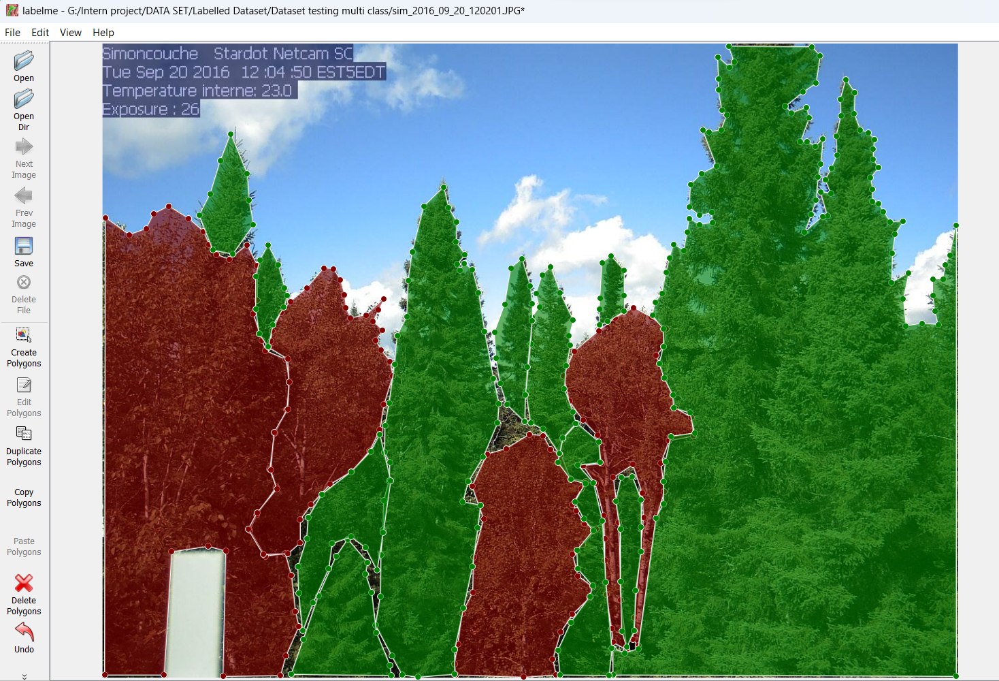
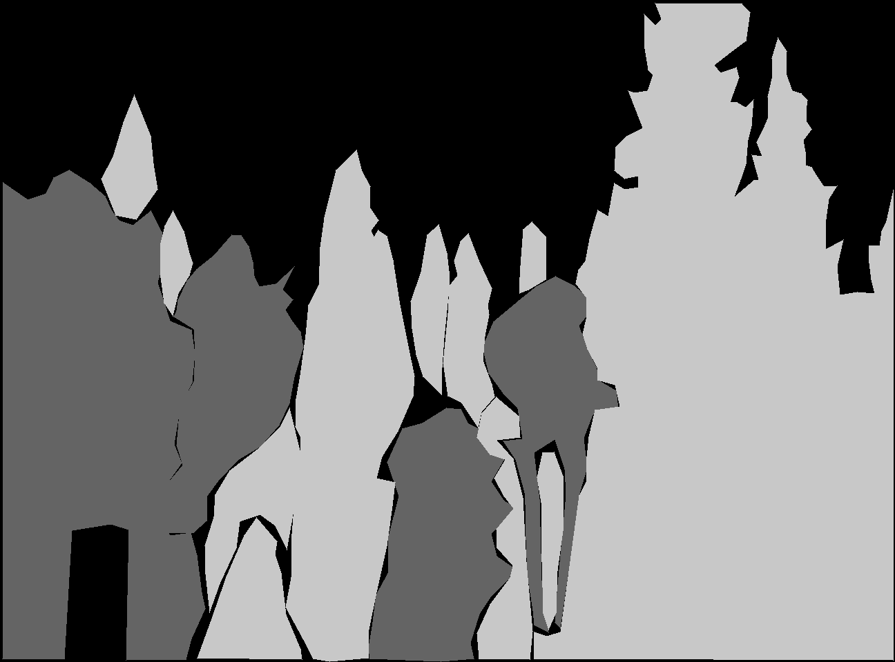
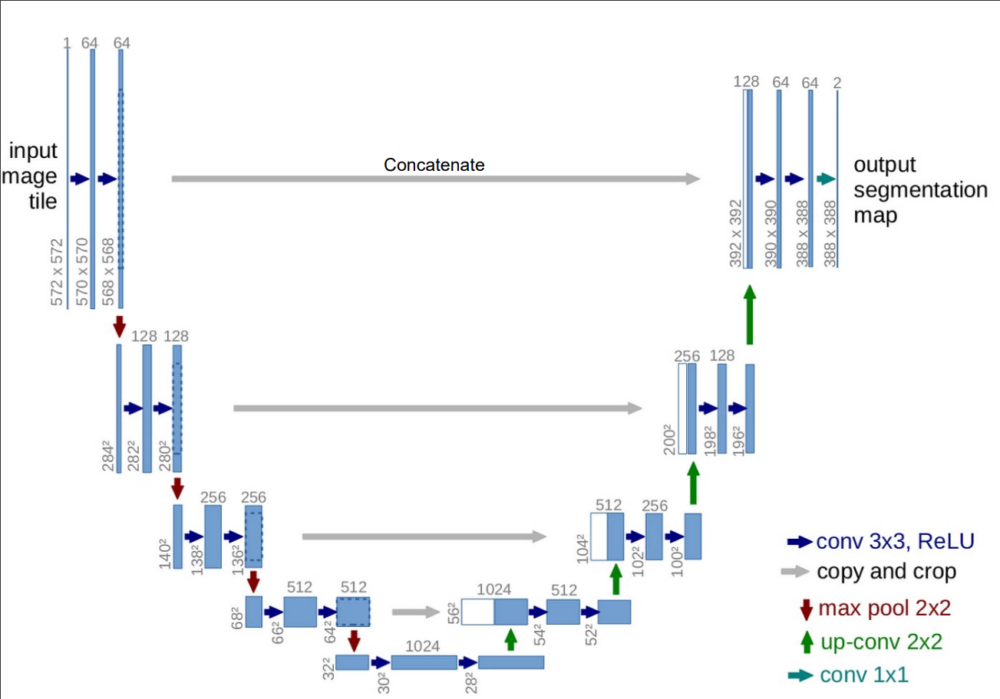
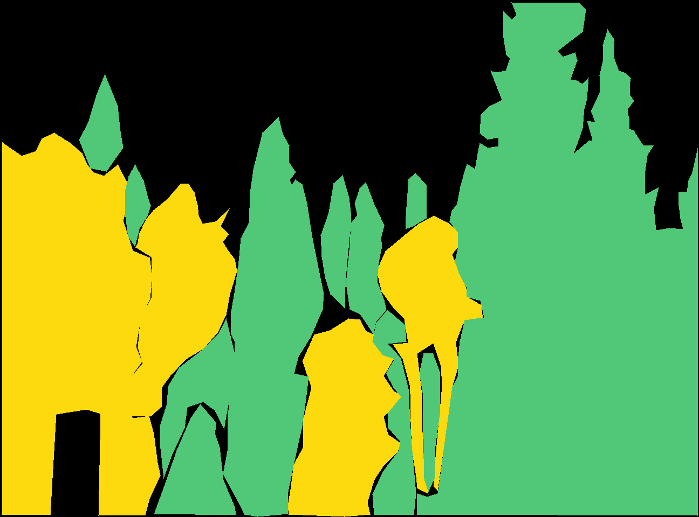
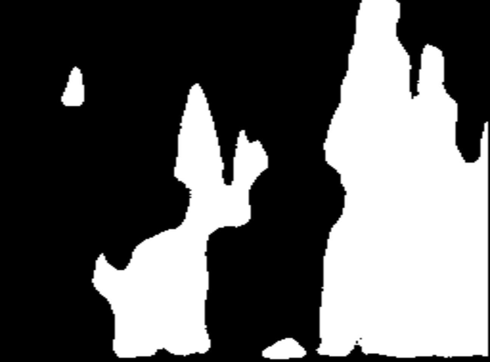
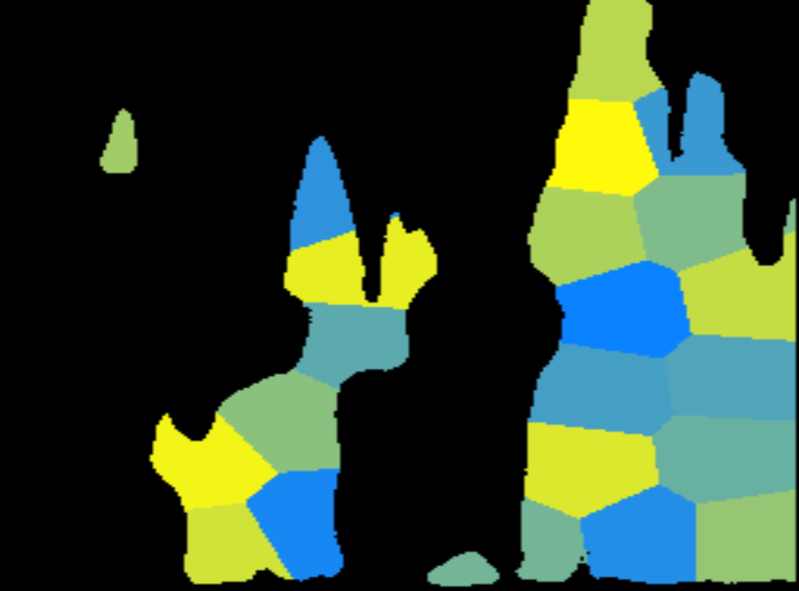
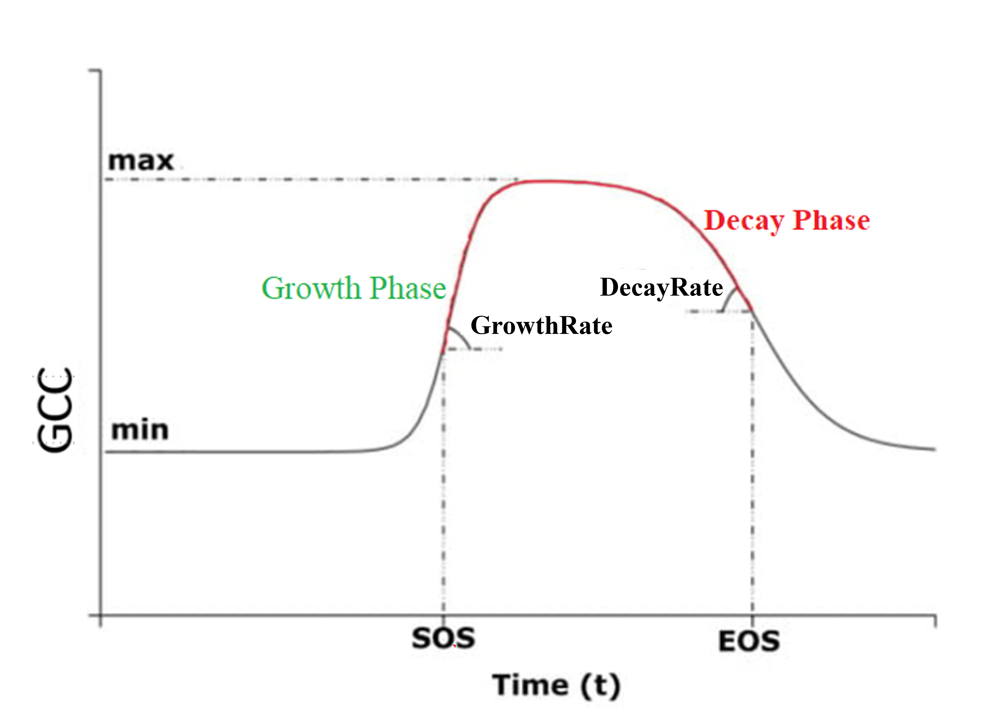
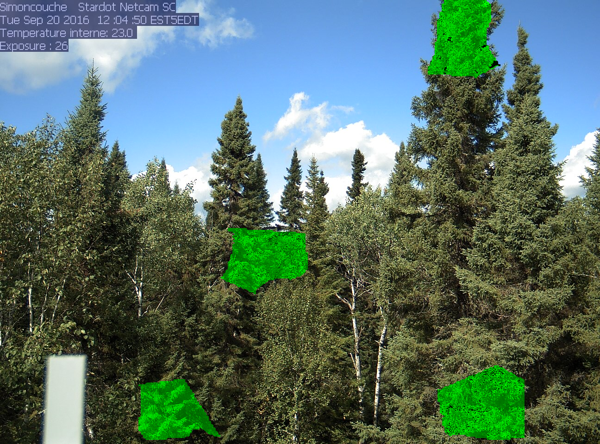

# **Developing Python Package to Analyze Vegetation phenology using Artificial Intelligence.**
### Objectives:
*	The project's aim is to Develop an AI-powered Python package to identify vegetation phenology for climate change and agriculture analysis.
*	The Package Conducts Image Segmentation using U-Net CNN Architecture to segment vegetation portions in the image. 
*	Phenology analysis was conducted on segmented vegetation masks, capturing evolution of vegetation within time series images of canadian forest are captured over the year.
  
The core of this application is a Python package that encompasses two main tasks: 1. Vegetation segmentation, 2. Phenology analysis

<br>

# **1. Image Segmentation: Vegetation Extraction**


(Refer [Vegetation Image Segmentation.ipynb](Vegetation%20Image%20Segmentation.ipynb) notebook)
<br>

## (a) Dataset

Data was captured throughout the year using a phenocam in a Canadian forest consisting of coniferous (evergreen) and deciduous trees.
Our analysis focuses on the evolution of coniferous tree vegetation.

<p align='center'>

</p>

**Labelling** : The images were manually labelled using the LabelME software. Polygon-shaped annotations were added to outline tree categories within each image. Corresponding label names, representing tree categories, are assigned to each polygon. 

<p align="center">

</p>


**Converting to Binary Image** :
The labelling process generates JSON files in which each categoey outlines are stored as polygon coordinates. For training, image masks is necessary as labels, with pixel values indicating different category portions. Hence, the JSON files were converted into grayscale images. (Refer [Json_to_mask.py](./phenoAI/Train_Pheno_AI/Json_to_mask.py))

<table align = 'center'>
    <tr>
    <td align="center">Json Label</td>
    <td align="center">Image Mask</td>
  </tr>
  <tr>
    <td></td>
    <td></td>
  </tr>
 </table>

## (b) Model Training:
### `UNet` Architecture:
<p align="center">

</p>

**Backbone**: EfficientNet
### *Perfomance Metrices and Loss* Function:
**Metrics** : 
<table align="center">
  <tr>
    <td></td>
    <td></td>
  </tr>
  <tr>
    <td align="center">Intersection over union</td>
    <td align="center">F1 score/dice coeffienct</td>
  </tr>
 </table>
 
**Loss function** : Jaccard loss(1-IoU) + Categorical Focal loss

Categorical Focal loss:<br>
$${L}\left({y,y'}\right)=-\sum_{i = 1}^{C}{α_i}\left({1-y'_i}\right)^{γ}{log(y'_i)}$$ 

<p align ='right'>
C : the total number of classes, &nbsp;  αi : class balancing factor for class i.<br> γ : focusing parameter,emphasize hard-to-classify examples.
</p>

## (c) Results: 
<p align ='center'>

 
</p>

**Test results**:
Loss:  0.1567,
iou : 0.9121,
f1-score : 0.9235

<table align='center'>
    <tr>
    <td align="center">Image</td>
    <td align="center">Actual Mask</td>
    <td align="center">Predicted Mask</td>

  </tr>
  <tr>
    <td></td>
    <td></td>
    <td></td>
  </tr>
 </table>

<br>


# **2. Phenology Analysis**

(Refer [Phenology Analysis.ipynb](Phenology%20Analysis.ipynb) notebook for the code)


Phenological analysis helps in understanding timing of plant growth and senescence. It is performed over time series vegetation images captured over a year from a forest site of Canada.

<h3>(a) Vegetation Extraction</h3>
Deep learning algorithms were utilized for precise vegetation extraction from images.

<table align='center'>
    <tr>
    <td align="center">Coniferous & Deciduous trees</td>
    <td align="center">Coniferous Portion</td>
  </tr>
  <tr>
    <td></td>
    <td></td>
  </tr>
 </table>

<h3>(b) Automatic ROIs Generation</h3>

The vegetation portion was divided into multiple Regions of Interest (ROIs) using the <strong>***k-means***</strong> algorithm.

This division facilitated examination of the variability within the vegetation population.
<p align='center'>

</p>

<h3>(c) GCC Calculation</h3>
GCC(Green Chromatic Coordinate) is one of the important index for greenness measurement. It is calculated for each ROI in the image.

GCC represents the green proportion among the Red, Green, and Blue (RGB) bands. <br>
GCC=sum(G band)/(sum(R band)+Sum(G band)+sum(B band))

<br>

<h3>(d) Curve Fitting</h3>

GCC values were plotted against the day of the year(doy) and fitted using a <strong> ***double logistic function*** </strong>.

Provides insights into the growth and declination of vegetation over time.


Greenness w.r.t time follow below curve:<br>
<p align='center'>

</p>
Function for representing Greenness evolution:

<p align='center'>

</p>
<!-- 
${y'}\left({DoY}\right)={min}+\left({max}-{min}\right)\left(\underbrace{\frac{{1}}{{{1}+{e}}^{-{GrowthRate}\left({DoY}-{SoS}\right)}}}_{σ1}+\underbrace{\frac{{1}}{{{1}+{e}}^{{DecayRate}\left({DoY}-{EoS}\right)}}}_{σ2}-{1}\right)$ -->

<h3>(e) Phenological Parameters Estimation</h3>
The double logistic function involved six parameters: maximum and minimum GCC values, Greenness growth and decay rates, and start and end dates of season(sos &eos).

Parameter values were estimated using a loss optimization technique called ***Gradient Descent***.

**Updated parameter**: &nbsp;&nbsp; ${θ'} = {θ} - \left({LearningRate}\right)\frac{∂J}{∂θ}$, &nbsp;&nbsp; $\frac{∂J}{∂θ} = \frac{1}{m}\sum{_{i = 1}^{m}} \left({y'}-{y}\right)\left(\frac{∂y'}{∂θ}\right)$

$\frac{∂y'}{∂min} = \left(\frac{max - y'}{max-min}\right)$, &nbsp; &nbsp;
$\frac{∂y'}{∂min} = \left(\frac{y'- min}{max-min}\right)$

$\frac{∂y'}{∂SoS} = \left({GrowthRate}\right)\left({max- min}\right)\left({σ1}\right)\left({1-σ1}\right)$, &nbsp;&nbsp;
$\frac{∂y'}{∂EoS} = -\left({DecayRate}\right)\left({max- min}\right)\left({σ2}\right)\left({1-σ2}\right)$ 

$\frac{∂y'}{∂GrowthRate} = -\left({DoY - SoS}\right)\left({max- min}\right)\left({σ1}\right)\left({1-σ1}\right)$, &nbsp;&nbsp;
$\frac{∂y'}{∂DecayRate} = \left({DoY -EoS}\right)\left({max- min}\right)\left({σ2}\right)\left({1-σ2}\right)$ 

<br>

# **3. Application Integration: 'phenoAI' python Package**

  
(Refer [PhenoAI package functioning.ipynb](PhenoAI%20package%20functioning.ipynb) notebook)

The PhenoAI package can be installed from provided whl file containing the modules of the package by running the following command in an jupyter environment:
```ruby
!pip install phenoAI-0.1-py3-none-any.whl
```

Dependencies: 
```
opencv-python,
tensorflow,
keras,
tqdm,
segmentation_models,
xlsxwriter,
albumentations
imgaug
```
All the required libraries and packages will be automatically installed with installation of PhenoAI.

The PhenoAI is divided in 2 modules. Its documentation is provided below.
## (a)  trainPhenoAI: 
The *\`trainPhenoAI(dataset_path, epochs,learning_rate, batch_size,is_augmentation)*\` function is used to create a segmentation model by training it through an image dataset. 

*\`dataset_path*\` : the location of the dataset containing images and labels. 
Optional Parameters: *\`epochs*\`, *\`learning_rate*\`, *\`batch_size*\`, *\`is_augmentation*\`(True to increase data)

This function has below sub-functions: 
- *\`reTrain(epochs)*\`: For Training the model for more epochs 
- *\`performanceReport()*\`: Gives us loss(or metrics) vs epochs graphs, scores of test data prediction
-	 *\`saveModel(saving_location)*\`: This function saves the trained phenological model. 

``` ruby
from phenoAI import trainPhenoAI
model = trainPhenoAI (dataset_path)
```
```
Saving Image masks of Json labels...|done
Orderwise Classes names:  ['deciduous', 'coniferous']
Loading Dataset images and masks for training...|done
Training the model...
Epoch 1/35
...
```
```ruby
model.reTrain(epochs =5)
model.saveModel(‘my_model.zip’)
```
**for getting performance report**
```ruby
model.performanceReport()
```

```
Test performance:
Loss:  0.1567145701646805
iou : 0.9121432443618774
f1-score : 0.923451619338989
```

## (b) loadModel:

The function *\`loadModel (model, dataset_path, class_name,date_pattern)*\` creates an analysis object for a specific class of trees in the dataset. 

The following are function's arguments:
- *\`model*\`: This is the location of the model zip file obtained from the *\`trainPhenoAI*\` module.
- *\`dataset_path*\`: This is the location of the images for analysis.
- *\`class_name*\`: This is the name of the tree category on which the analysis will be performed. 
- *\`date_pattern*\`: This is used for extracting date from image name. <br>
This should match with image file name. It should contain 'yyyy', 'dd' and 'mm', and '*' charecter. '\*' is used for covering zero aur more consequent characters.<br>
For Example: for file 'Sd-<u>20221204</u>-15_sdg.jpg', pattern can be: '\*yyyymmdd-\*' or '\*-yyyymmdd-\*'.

```ruby
from phenoAI import loadModel
pheno = loadModel (model_path, dataset, vegetation_name, “_*yyyy-mmdd_*”)
```
```
Loading Vegetation segmentation Model...|done
Importing Dataset...|done
Creating ROIs in the vegetation segment...|done
Extracting Chromatic chromatic coordinate from Images...|done
Calculating phenological Parameters...|done
```
The analysis object created by this function includes the following functions:

- *\`showROIs()*\`: This displays the images with selected ROIs.
- *\`extractGCCParameters()*\`: This function extracts the six phenological parameters for GCC.
- *\`plotGCC()*\`: This function plots GCC versus Day of Year (DoY) graph.
- *\`saveGCCPlot(path_location)*\`: This function saves the GCC vs. DoY plot images in the 
- *\`saveCCsTimeSeries(path_location)*\`: This function saves all records of GCC, BCC, RCC, and six phenological parameters in an Excel file at the given location. 


Showing ROIs:
```ruby
pheno.saveROIsImage("ROI_image.jpg")
pheno.showROIs()
```
        

Plotting GCC w.r.t. Day of year:
```ruby
pheno.saveGCCPlot("GCC_plot.jpg")
pheno.plotGCC()
```
         

Phenological Parameters: 
```ruby
min, max, slope1, SoS, slope2, EoS = pheno.extractGCCParameters()
```
```
Maximum GCC: 0.4
Start of season(DoY):  117
End of season:  302
Greenary increasing rate: 0.048
Greenary decreasing rate: 0.036
```
Saving all the record of parameters and chromatic coordinates:
``` ruby
pheno.saveCCsTimeSeries(r"G:\packege testing")
```
 
